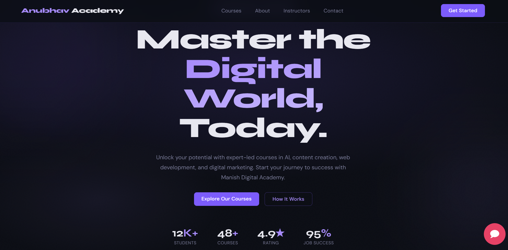
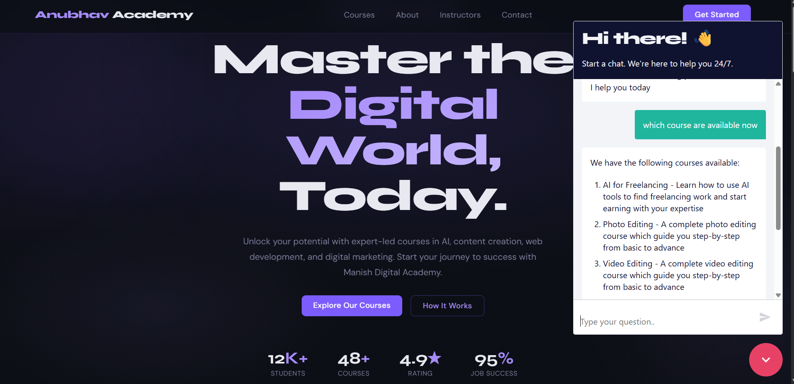
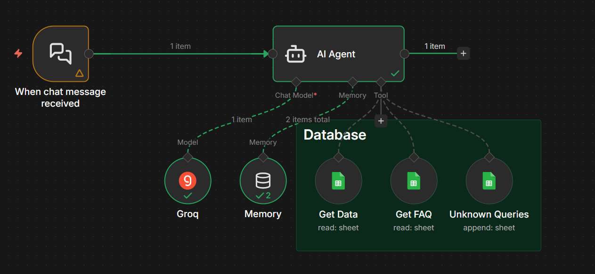

# 🤖 AI Website Chatbot Integration (HTML/CSS + n8n)

## 📌 Problem Statement

Modern websites require instant customer interaction and automated support systems to improve user experience. This project demonstrates how an AI-powered chatbot can be integrated into a frontend website using n8n workflow automation.

The goal of this project is to show how websites can connect with AI workflows to provide intelligent responses, automate conversations, and improve engagement.

---

# 📁 Project Overview

This project is a frontend-based website chatbot integration built using:

* HTML
* CSS
* n8n Workflow Automation
* AI Agent Integration

The chatbot accepts user queries from the website interface, sends them to an n8n webhook, processes them through an AI workflow, and returns responses back to the website.

---

# ⚙️ Key Features

* 💬 AI-powered chatbot interface
* 🌐 Frontend website integration
* 🔗 n8n webhook connectivity
* 🤖 AI response generation
* ⚡ Real-time chatbot interaction
* 🎨 Responsive chatbot UI
* 🧠 Workflow-based automation architecture

---

# 🏗️ System Architecture

```text
User → Website Chatbot UI → n8n Webhook → AI Workflow → Response → Website UI
```

---

# 📸 Project Screenshots


## Website Overview



## 🖥️ Website Chatbot UI



## ⚙️ n8n Workflow


---

# 🔄 Workflow Explanation

1. User sends a message through the chatbot interface.
2. Frontend sends the message to the n8n webhook using API requests.
3. n8n receives the request and triggers the AI workflow.
4. AI processes the user query.
5. Response is returned back to the website chatbot.
6. Chatbot displays the generated response to the user.

---

# 🛠️ Technologies Used

| Technology     | Purpose               |
| -------------- | --------------------- |
| HTML           | Website Structure     |
| CSS            | Website Styling       |
| n8n            | Workflow Automation   |
| Webhooks       | API Communication     |
| AI Agent / LLM | Intelligent Responses |

---

# 🧠 Business Use Cases

* Customer support chatbot
* Educational website assistant
* FAQ automation
* Lead generation chatbot
* AI assistant integration for websites

---

# 📊 Learning Outcomes

This project demonstrates:

* Frontend and AI workflow integration
* API communication using webhooks
* Real-time chatbot interaction
* Basic AI automation architecture
* Practical implementation of workflow orchestration

--- 

# 👨‍💻 Author

**Anubhav Upadhyay**
Data Analyst | AI Enthusiast | SQL | Python | Power BI | AI

---

# ⭐ Project Goal

This project was built to demonstrate how AI chatbots can be integrated into websites using workflow automation tools like n8n and frontend technologies.
